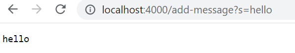
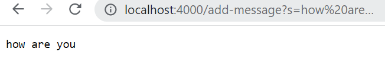
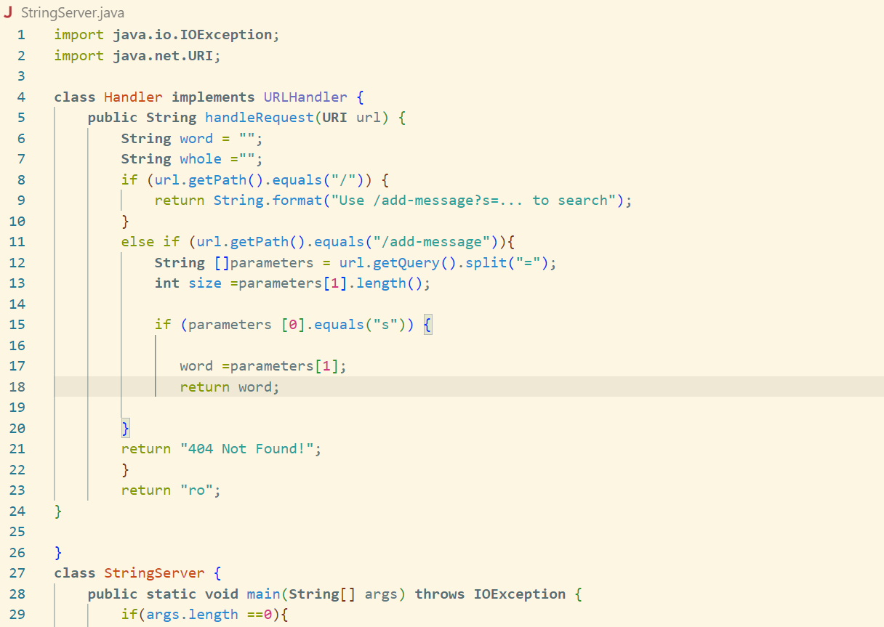
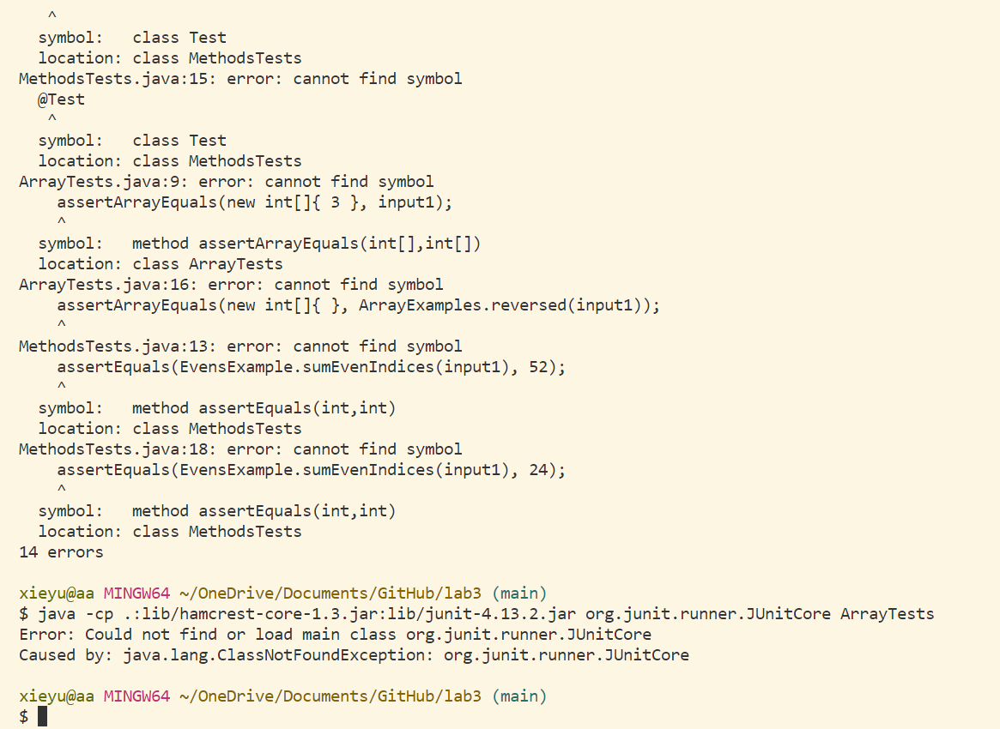

# Servers and Bugs

## Part 1

* handleRequest methods in my code are called
* the relevant arguments are patameters and the path
* if no values got changed, then the web server will have no change, because the parameters[1] related to the output. If no values changes, the output will have no change.

## Part 2

* This is the failure-inducing input for the buggy program, since MAC and Windows use different system, so different system have different associated code.

## Part 3
In week 3, I learn that there is a different code of JUnit test for MAC user and Windows User. Also for the failure inducing input, we have to check really carefully, since a little bit of the mistake on the calculator for loop part will make the output different.

